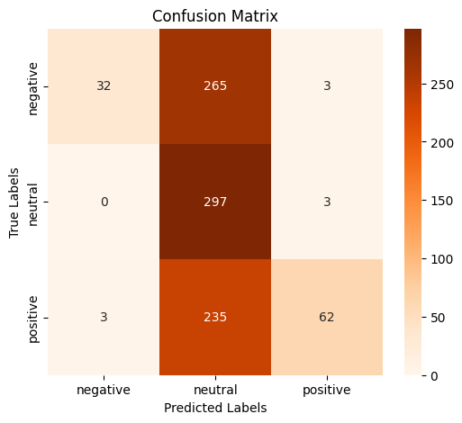
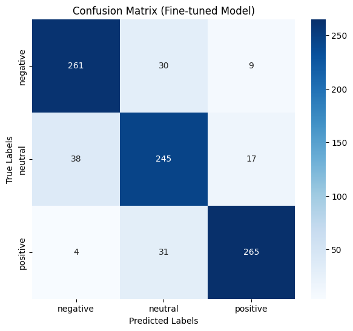
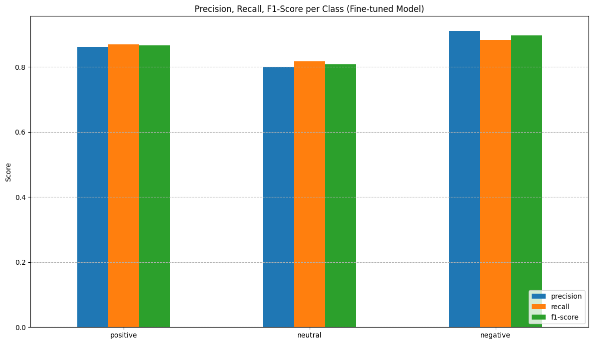
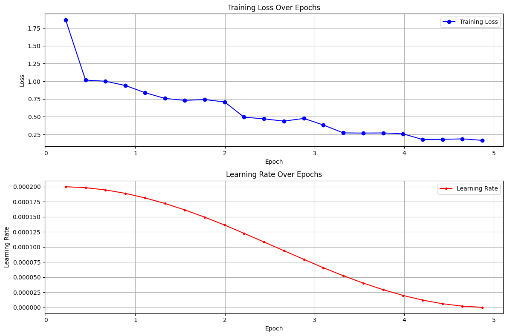
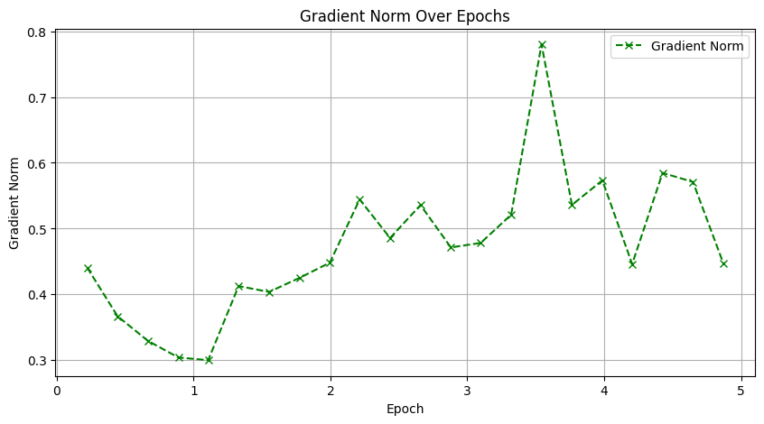

# Llama-3 8B ile Finansal Metinler İçin Duygu Analizi (QLoRA ile İnce Ayar)

Bu proje, Üretken Yapay Zeka dersi kapsamında geliştirilmiş olup, Meta'nın Llama-3-8B-Instruct modelini kullanarak finansal haber başlıkları ve metinleri üzerinde duygu analizi yapmayı amaçlamaktadır. Model, QLoRA (Quantized Low-Rank Adaptation) tekniği ile "pozitif", "negatif" veya "nötr" duygu sınıflarını tanımak üzere ince ayarlanmıştır.

## Projeye Genel Bakış

Bu çalışmada, büyük bir dil modelinin (LLM) belirli bir görev için (finansal duygu analizi) nasıl daha verimli ve etkili bir şekilde eğitilebileceği gösterilmektedir. QLoRA yöntemi, modelin büyük bir kısmını 4-bit kuantizasyon ile dondurarak ve sadece küçük sayıda eğitilebilir LoRA adaptörlerini güncelleyerek bellek ve hesaplama kaynağı tasarrufu sağlar.

Proje, aşağıdaki ana bileşenleri içeren notebook'lar aracılığıyla sunulmaktadır:

1.  **`notebooks/ft1.ipynb`**:
    *   **Ana Eğitim Notebook'u:** Bu notebook, projenin temel adımlarını içerir:
        *   Gerekli Python kütüphanelerinin (PyTorch, Transformers, PEFT, TRL, bitsandbytes vb.) kurulumu.
        *   `meta-llama/Meta-Llama-3-8B-Instruct` temel modelinin Hugging Face Hub'dan indirilmesi/yüklenmesi ve 4-bit kuantizasyonu.
        *   Finansal duygu analizi için etiketlenmiş veri setinin (`data/data.csv`) yüklenmesi ve eğitim/değerlendirme/test setlerine ayrılması.
        *   **İnce ayar öncesi** temel modelin duygu analizi performansının değerlendirilmesi.
        *   QLoRA konfigürasyonlarının (LoRA katmanları, rank, alpha vb.) belirlenmesi.
        *   TRL kütüphanesinden `SFTTrainer` kullanılarak modelin ince ayarının yapılması.
        *   **İnce ayar sonrası** eğitilmiş modelin (adaptörlerle birlikte) performansının test seti üzerinde değerlendirilmesi.
        *   Eğitilmiş LoRA adaptörlerinin ve tokenizer'ın kaydedilmesi.

2.  **`notebooks/testft1.ipynb`**:
    *   **Detaylı Test ve Görselleştirme Notebook'u:** Bu notebook, `ft1.ipynb`'de eğitilen modelin performansını daha detaylı analiz eder ve görselleştirir:
        *   İnce ayar yapılmış modelin yüklenmesi.
        *   Test veri seti üzerinde tahminler yaparak doğruluk, kesinlik (precision), duyarlılık (recall) ve F1-skoru gibi metriklerin hesaplanması.
        *   Karmaşıklık matrislerinin (ince ayar öncesi ve sonrası) oluşturulması ve görselleştirilmesi.
        *   Eğitim sürecindeki kayıp (loss), öğrenme oranı (learning rate) ve gradyan normu gibi metriklerin grafiklerinin çizdirilmesi.
        *   Bu testler, modelin öğrenme sürecini ve farklı duygu sınıflarındaki performansını anlamamıza yardımcı olur.

3.  **`notebooks/easytest.ipynb` (veya `easytest_financial_sentiment.ipynb`)**:
    *   **Hızlı Test Notebook'u:** Bu notebook, eğitilmiş modelin ve adaptörlerin Hugging Face Hub'dan çekilerek kolayca test edilebilmesi için tasarlanmıştır.
        *   Kullanıcının sadece birkaç örnek finansal cümle girmesiyle modelin duygu tahminlerini hızlıca görmesini sağlar.
        *   Modelin pratik kullanımını ve erişilebilirliğini gösterir.
## Veri Seti

Bu projede kullanılan veri seti `data/data.csv` dosyasında bulunmaktadır. Veri seti, makine öğrenimi platformu Kaggle'da bulunan ve finansal duygu analizi çalışmaları için yaygın olarak kullanılan **"Financial Sentiment Analysis"** veri setidir.

Bu veri seti, özellikle finansal haber başlıklarından ve kısa metinlerden oluşmakta olup, her bir metin için "pozitif", "negatif" veya "nötr" olmak üzere üç temel duygu etiketinden biri atanmıştır. Modelin eğitimi ve değerlendirilmesi bu etiketlenmiş verilere dayanmaktadır.

Veri setinin orijinal kaynağına ve daha detaylı bilgisine aşağıdaki Kaggle bağlantısından ulaşabilirsiniz:
*   [Financial Sentiment Analysis on Kaggle](https://www.kaggle.com/datasets/sbhatti/financial-sentiment-analysis/data)
*   
## Kullanılan Teknolojiler ve Kütüphaneler

*   **Model:** `meta-llama/Meta-Llama-3-8B-Instruct`
*   **İnce Ayar Tekniği:** QLoRA (Quantized Low-Rank Adaptation)
*   **Temel Kütüphaneler:**
    *   PyTorch
    *   Transformers (AutoModelForCausalLM, AutoTokenizer, BitsAndBytesConfig, pipeline)
    *   PEFT (LoraConfig, PeftModel)
    *   TRL (SFTTrainer, SFTConfig)
    *   bitsandbytes (4-bit kuantizasyon için)
    *   Datasets
    *   scikit-learn (performans metrikleri)
    *   Pandas, NumPy (veri işleme)
    *   Matplotlib, Seaborn (görselleştirme)
    *   Hugging Face Hub (model ve adaptör paylaşımı)

## Kurulum ve Çalıştırma

1.  **Repository'yi Klonlayın:**
    ```bash
    git clone https://github.com/azizdeniz890/Llama3-Financial-Sentiment-QLoRA.git
    cd Llama3-Financial-Sentiment-QLoRA
    ```
2.  **Gerekli Kütüphaneleri Kurun:**
    Proje için gerekli Python kütüphanelerini `requirements.txt` dosyasını kullanarak kurun:
    ```bash
    pip install -r requirements.txt
    ```
    (Colab ortamında çalıştırıyorsanız, notebook'ların içindeki `!pip install` komutları bu işlemi yapacaktır.)
3.  **Notebook'ları Çalıştırın:**
    *   Eğitim sürecini ve detaylı analizleri görmek için `notebooks/ft1.ipynb` ve ardından `notebooks/testft1.ipynb` dosyalarını çalıştırın.
    *   Modeli hızlıca test etmek için `notebooks/easytest_financial_sentiment.ipynb` dosyasını çalıştırın.
    *   **Not:** Notebook'ları çalıştırırken (özellikle Colab'da) GPU (tercihen A100 veya benzeri) kullanmanız önerilir. Hugging Face Hub'dan model indirme/yükleme işlemleri için token gerekebilir.

## Veri Seti

Bu projede kullanılan veri seti `data/data.csv` dosyasında bulunmaktadır. Finansal metinler ve bunlara karşılık gelen "pozitif", "negatif" veya "nötr" duygu etiketlerini içerir.

## Sonuçlar ve Değerlendirme

Bu bölümde, Llama-3-8B-Instruct modelinin finansal duygu analizi görevindeki performansı, hem ince ayar (fine-tuning) öncesi "saf" haliyle hem de QLoRA adaptörleri ile ince ayar yapıldıktan sonraki haliyle karşılaştırmalı olarak sunulmaktadır. Değerlendirmeler, ayrılmış test veri seti üzerinde yapılmıştır.

### İnce Ayar Öncesi Model Performansı (Temel Model)

Temel `meta-llama/Meta-Llama-3-8B-Instruct` modelinin, herhangi bir ek ince ayar yapılmadan önceki performansı, finansal duygu analizi görevine ne kadar hazır olduğunu anlamak için değerlendirilmiştir.

*   **Genel Doğruluk (Overall Accuracy):** **%43.4**

Modelin sınıflar bazındaki doğruluğu incelendiğinde:
*   Negatif (Label 0) sınıfını tanıma doğruluğu: %10.7
*   Nötr (Label 1) sınıfını tanıma doğruluğu: %99.0
*   Pozitif (Label 2) sınıfını tanıma doğruluğu: %20.7

Bu sonuçlar, temel modelin özellikle "nötr" etiketli metinleri yüksek bir doğrulukla tahmin edebildiğini, ancak "pozitif" ve özellikle "negatif" duyguları ayırt etmede zorlandığını göstermektedir. Bu durum, genel amaçlı eğitilmiş büyük dil modellerinin spesifik görevlerde ek ince ayar gerektirdiğinin tipik bir örneğidir.

**Karmaşıklık Matrisi (İnce Ayar Öncesi):**
Bu matris, modelin hangi sınıfları birbiriyle karıştırdığını göstermektedir. Özellikle "pozitif" ve "negatif" etiketli birçok örneğin yanlışlıkla "nötr" olarak sınıflandırıldığı görülmektedir.


**Sınıflandırma Raporu Özeti (İnce Ayar Öncesi):**
Modelin precision, recall ve F1-skor değerleri incelendiğinde, "nötr" sınıf için recall değeri çok yüksekken (%99), "negatif" (%11) ve "pozitif" (%21) sınıflar için oldukça düşüktür. Bu da modelin bu iki duygu kategorisini etkin bir şekilde yakalayamadığını teyit eder.

### İnce Ayar Sonrası Model Performansı (QLoRA ile)

QLoRA tekniği ile finansal veri seti üzerinde ince ayar yapıldıktan sonra modelin performansında belirgin bir artış gözlemlenmiştir.

*   **Genel Doğruluk (Overall Accuracy):** **%85.9**

Bu, ince ayar öncesine göre **%42.5 puanlık bir iyileşme** anlamına gelmektedir.

Modelin sınıflar bazındaki doğruluğu ise şu şekilde değişmiştir:
*   Negatif (Label 0) sınıfını tanıma doğruluğu: %87.7 (önceki %10.7'den büyük artış)
*   Nötr (Label 1) sınıfını tanıma doğruluğu: %81.3 (önceki %99.0'dan bir miktar düşüş, ancak diğer sınıflardaki kazançla dengelenmiş)
*   Pozitif (Label 2) sınıfını tanıma doğruluğu: %88.7 (önceki %20.7'den büyük artış)

İnce ayar, modelin özellikle "pozitif" ve "negatif" duyguları tanıma yeteneğini önemli ölçüde geliştirmiştir. "Nötr" sınıfındaki hafif düşüş, modelin artık diğer iki sınıfa daha fazla odaklanmasından ve bu sınıfları daha iyi ayırt edebilmesinden kaynaklanmaktadır.

**Karmaşıklık Matrisi (İnce Ayar Sonrası):**
İnce ayar sonrası karmaşıklık matrisi, modelin her üç sınıf için de önemli ölçüde daha dengeli ve doğru tahminler yaptığını göstermektedir. Yanlış sınıflandırmalar azalmıştır.


**Sınıf Bazlı Precision, Recall, F1-Skoru (İnce Ayar Sonrası):**
Bu grafik, her bir duygu sınıfı için precision, recall ve F1-skor değerlerini göstermektedir. Tüm sınıflar için dengeli ve yüksek skorlar elde edildiği görülmektedir, bu da modelin genel performansının iyileştiğini ve her bir duygu türünü daha etkin bir şekilde ayırt edebildiğini gösterir.


**Sınıflandırma Raporu Özeti (İnce Ayar Sonrası):**
*   **Negatif:** Precision: %86, Recall: %88, F1-Score: %87
*   **Nötr:** Precision: %80, Recall: %81, F1-Score: %81
*   **Pozitif:** Precision: %91, Recall: %89, F1-Score: %90

Bu değerler, modelin her üç duygu kategorisinde de güçlü bir performans sergilediğini ortaya koymaktadır.

### Eğitim Süreci Grafikleri

Eğitim süreci boyunca modelin öğrenme dinamikleri aşağıdaki grafiklerle izlenmiştir:

**Eğitim Kaybı (Loss) ve Öğrenme Oranı (Learning Rate) Değişimi:**
Bu grafik, eğitim epoch'ları boyunca modelin kayıp fonksiyonunun (loss) nasıl azaldığını ve öğrenme oranının (learning rate) zamanla nasıl değiştiğini gösterir. Kaybın düşmesi, modelin veri setindeki örüntüleri öğrendiğini işaret eder.


**Gradyan Normu Değişimi:**
Bu grafik, eğitim sırasında gradyanların büyüklüğünün (norm) nasıl değiştiğini gösterir. Gradyan normunun çok yüksek veya çok düşük olmaması, stabil bir öğrenme süreci için önemlidir.


### Genel Değerlendirme

Elde edilen sonuçlar, QLoRA ile yapılan ince ayarın, Llama-3-8B-Instruct modelinin finansal metinlerdeki duygu analizi görevindeki performansını önemli ölçüde artırdığını ve modeli bu spesifik görev için çok daha yetkin hale getirdiğini açıkça göstermektedir. Model, özellikle zorlayıcı olabilen "pozitif" ve "negatif" duyguları ayırt etmede büyük bir ilerleme kaydetmiştir.

## Adaptörlerin Kullanımı (Hugging Face Hub)

Eğitilmiş QLoRA adaptörleri, `azizdeniz890/Llama3-8B-Financial-Sentiment-LoRA` Hugging Face Hub reposundan çekilerek kullanılabilir. Detaylı kullanım örneği için `notebooks/easytest_financial_sentiment.ipynb` dosyasına bakınız.

## Katkıda Bulunan

*   Aziz Deniz ([azizdeniz890](https://github.com/azizdeniz890)) - azizdeniz098@gmail.com
